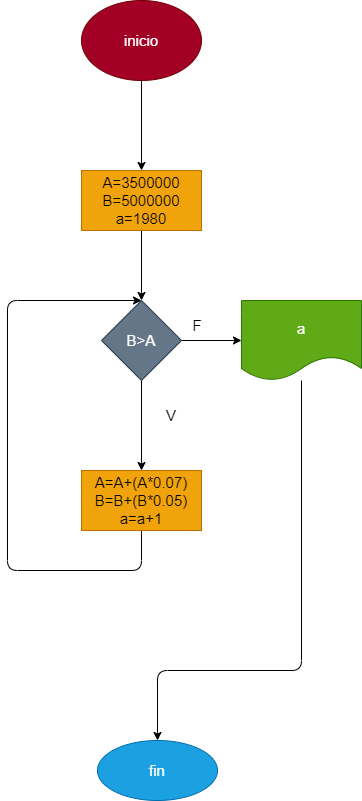

# Crecimiento_poblacional

# Ejercicio N. 3. repetitivos: En 1980 la ciudad A tenia 3.5 millones de habitantes y una rata  de crecimiento de 7% anual; y la ciudad B tenia 5 millones y una rata de crecimiento de 5% anual. si el crecimiento poblacional se mantiene constante en las dos ciudades, hacer el diagrama de flujo y el programa en python que calcule e imprima en que año la poblacion de la ciudad A es mayor que la de la ciudad B. 

## Diagrama de flujo 